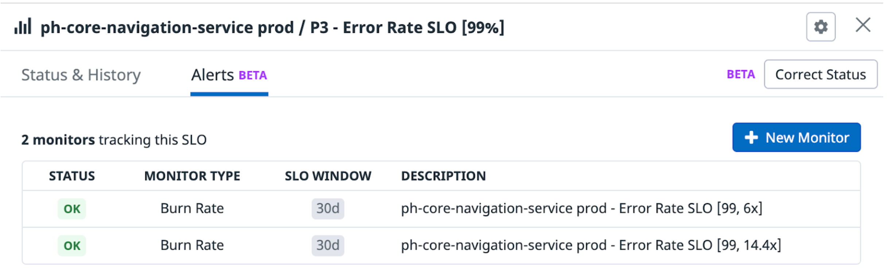

<!-- .slide: data-background-color="var(--r-main-color)"  -->

# Resilience Against Downstream Failures

???

---

## Mario Fernandez

<h3 class="main">
Wayfair
</h2>

<span class="bottom-right"><a href="https://hceris.com/">hceris.com/<a></span>
 
???

- I'm an engineer at Wayfair
- In case you don't know, Wayfair is an online retailer that sells furniture

---

<h2 class="main">
What I Want to Cover
</h2>

<h3 class="fragment fade-up">
Resilience Operators
</h3>

<h3 class="fragment fade-up">
Fallback Cache
</h3>

<h3 class="fragment fade-up">
Taking It to the Next Level
</h3>

???

---

<!-- .slide: data-background-color="var(--r-main-color)"  -->

# A Bit of Context

---

## Partner Home @ Wayfair

---

<!-- .slide: data-background-image="images/partner-home.png" data-background-size="auto 100%" -->

???

- This is Partner Home
- This is the portal that suppliers use in Wayfair to upload their wares, track inventory, logistics, and so on
- It's less visible than the store that most of our users experience. It's nevertheless really important for the health of the business
---

## Rough numbers

### ~100 flows
### ~30 experience teams

???

- It's a pretty significant piece of software, with a lot of teams involved

---

<!-- .slide: data-background-image="images/decoupling.png" data-background-size="90% auto" -->

???

- This application started, as it often does, as a monolith written in PHP. 
- Things have changed in the last two years, and we're moving to an architecture based on decoupled services

---

<!-- .slide: data-background-image="images/navigation.png" data-background-size="100% auto" -->

???

- among all these services, my team owns the navigation bar
- it's present in almost every page
- it's a surprisingly complex piece, with a FE and a BE that integrates mutiple sources of data to determine permissions to show nav items

---

<!-- .slide: data-background-color="var(--r-main-color)"  -->

# Issues 💣💥🔥

---

## Reliant on legacy monolith

---

<!-- .slide: data-background-image="images/errors.png" data-background-size="auto 90%" -->

???

- long intervals of elevated error rates are pretty typical

---

<!-- .slide: data-background-image="images/incidents.png" data-background-size="auto 90%" -->

---

## Humane On-Call
### DevoxxUK 2021

<span class="bottom-right">
<a href="https://www.youtube.com/watch?v=X59Sfaey5N4">www.youtube.com/watch?v=X59Sfaey5N4</a>
</span>

---

<!-- .slide: data-background-color="var(--r-main-color)"  -->

# Resilience Operators

???

- 14/50
- this part is about being a good citizen in a services ecosystem

---

## Circuit breaker

---

<!-- .slide: data-background-image="images/circuitbreaker.png" data-background-size="auto 90%" -->

---

## Retry

---

<!-- .slide: data-background-image="images/retry.png" data-background-size="60% auto" -->

---

## No need to build from scratch

---

## Resilience4j

<span class="bottom-right">
<a href="https://resilience4j.readme.io/">resilience4j.readme.io/</a>
</span>

???

- the successor of hystrix

---

```java
@CircuitBreaker(name = BACKEND, fallbackMethod = "fallback")
@RateLimiter(name = BACKEND)
@Bulkhead(name = BACKEND)
@Retry(name = BACKEND, fallbackMethod = "fallback")
@TimeLimiter(name = BACKEND)
public Mono<String> method(String param1) {
    return Mono.error(new NumberFormatException());
}

private Mono<String> fallback(String param1, IllegalArgumentException e) {
    return Mono.just("test");
}

private Mono<String> fallback(String param1, RuntimeException e) {
    return Mono.just("test");
}
```

---

## Alternative to annotations
### Reusable abstraction ➡️  _SyncFallbackCache_

---

### Creating an operator

```java [|2|3]
Retry getRetry(String name, MeterRegistry meterRegistry) {
  RetryRegistry retryRegistry = RetryRegistry.ofDefaults();
  TaggedRetryMetrics.ofRetryRegistry(retryRegistry).bindTo(meterRegistry);
  return retryRegistry.retry(name);
}

CircuitBreaker getCircuitBreaker(String name, MeterRegistry meterRegistry) {
  CircuitBreakerRegistry circuitBreakerRegistry = CircuitBreakerRegistry
      .ofDefaults();
  TaggedCircuitBreakerMetrics
      .ofCircuitBreakerRegistry(circuitBreakerRegistry).bindTo(meterRegistry);
  return circuitBreakerRegistry.circuitBreaker(name);
}
```

---

```java [|11-12|13-14|17-18]
/**
 * Fetches data synchronously
 *
 * @param key           the key that identifies the object
 * @param valueSupplier a supplier to perform the call
 * @return the data returned from the service, or from the cache
 * @throws io.github.resilience4j.circuitbreaker.CallNotPermittedException 
 * @throws RuntimeException                                                
 */
public T get(String key, Supplier<R> valueSupplier) {
  Supplier<T> decoratedSupplier = Decorators
      .ofSupplier(() -> getAndCache(key, valueSupplier))
      .withRetry(retry)
      .withCircuitBreaker(cb).decorate();

  return Try.ofSupplier(decoratedSupplier)
      .recover(RuntimeException.class, 
          (exception) -> getFromCacheOrThrow(key, exception))
      .get();
}
```

---

## High-level usage

```java [|1|8-11]
private SyncFallbackCache<Collection<SupplierUserPermission>> permissions;

private Collection<SupplierUserPermission> getPermissions(
    String extranetUserId, 
    int supplierId) {
  return permissions.get(
      () -> String.format("exuId:%s;suId:%s", extranetUserId, supplierId),
      () -> client.getUserPermissions(extranetUserId, supplierId)
          .getData()
          .getSupplierUserMyInformation()
          .getPermissions()
  );
}
```
---

## What about _Reactor_?
### Support for _Mono_ ➡️  _AsyncFallbackCache_

---

## Let's not forget monitoring

---

<!-- .slide: data-background-image="images/resilience-monitoring.png" data-background-size="90% auto" -->

---

<!-- .slide: data-background-color="var(--r-main-color)"  -->

# Fallback Cache

???

- 29/50

---

## Graceful degradation

---

<!-- .slide: data-background-image="images/degradation.png" data-background-size="auto 80%" -->

---

## Caffeine

<span class="bottom-right">
<a href="https://github.com/ben-manes/caffeine">github.com/ben-manes/caffeine</a>
</span>

---

```java [|2-6|8]
static <R> Cache<String, R> cache(String name, MeterRegistry meterRegistry) {
  Cache<String, R> cache = Caffeine.newBuilder()
      .recordStats()
      .expireAfterWrite(Duration.ofHours(24))
      .maximumSize(6000)
      .build();

  CaffeineCacheMetrics.monitor(meterRegistry, cache, name);
  return cache;
}
```

---

```java
protected T getAndCache(Supplier<String> keySupplier, Supplier<T> valueSupplier) {
  var result = valueSupplier.get();
  if (result != null) {
    cache.put(keySupplier.get(), result);
  }
  return result;
}
```

---

```java
protected T getFromCacheOrThrow(
    Supplier<String> keySupplier, 
    RuntimeException exception) {
  var value = cache.getIfPresent(keySupplier.get());

  if (value == null) {
    log.error(String.format(
        "FallbackCache[%s] got an error without a cached value", 
        cb.getName()), 
        exception);
    throw exception;
  }

  log.info(String.format(
      "FallbackCache[%s] got cached value", 
      cb.getName()), 
      value);

  return value;
}
```

---

## Does the caching work?
### Hit Rate %

---

<!-- .slide: data-background-image="images/bad-hitrate.png" data-background-size="90% auto" -->

---

<!-- .slide: data-background-color="var(--r-main-color)"  -->

# Taking It to the Next Level

???

- 38/50

---

## Ephemeral caching won't cut it

---

## Aerospike

<span class="bottom-right"><a href="https://www.aerospike.com">aerospike.com/</a></span>

---

## Spring Data

```java
public interface NavigationRepository extends 
    AerospikeRepository<CachedNavigation, String> {
}
```

---

## Serializable models

```java
@Value
@Document(collection = "navigation_CachedNavigationMenu")
public class CachedNavigation implements Cacheable<List<LegacyNavMenuItem>> {
  @Id
  String id;
  List<LegacyNavMenuItem> navigation;

  @Override
  public List<LegacyNavMenuItem> data() {
    return navigation;
  }
}
```

---

<!-- .slide: data-background-image="images/aerospike-cli.png" data-background-size="90% auto" -->

---

## Side note
### _Testcontainers_ is a life saver!

<span class="bottom-right"><a href="https://www.testcontainers.org/">www.testcontainers.org/</a></span>

???

- I would go into this more if I had more time. We used the opportunity to leverage testcontainers to set up integration tests with a local Aerospike instance. Great stuff.

---

## Did it work this time?
### Hit Rate %

---

<!-- .slide: data-background-image="images/good-hitrate.png" data-background-size="90% auto" -->

---

<!-- .slide: data-background-color="var(--r-main-color)"  -->

# Let's Finish With Some Numbers

---

## Error Rate %

<h3><span class="danger fragment fade-up">2.2%</span><span class="fragment fade-up"> ➡️ </span><span class="fragment fade-up success">0.03%</span></h3>

---



<span class="bottom-right"><a href="https://hceris.com/multiwindow-multi-burn-rate-alerts-in-datadog/">hceris.com/multiwindow-multi-burn-rate-alerts-in-datadog/<a></span>

---
